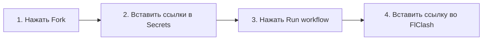

# 🚀 Mihomo Smart Routing & Multi-Subscription Merger

[](LICENSE)
[](.github/workflows/sync-hourly.yml)
[-orange.svg)](https://github.com/MetaCubeX/mihomo)
[]()

Универсальный инструмент для **объединения нескольких VPN-подписок** (VLESS, VMess, Shadowsocks, Trojan) в **единую автообновляемую ссылку** с интеллектуальным разделением трафика.

---

## ⚡ Что умеет эта система:

* 🔀 **Объединение любых провайдеров:** склеивает ссылки разных VPN-сервисов в один конфиг, удаляет дубликаты и автоматически обходит защитные Nginx-куки (307 redirect) и капризные User-Agent.
* 🤖 **`🤖 AI-Services`** — Gemini, Claude, OpenAI/ChatGPT автоматически идут через быстрые серверы США/Европы с надежным `Auto-Fallback` (никаких ошибок региона).
* 🎬 **`🎬 Media-Streaming`** — YouTube и SoundCloud идут через выделенные стриминг-серверы без буферизации.
* 💬 **`💬 Discord`** — голосовые каналы (UDP) и медиа работают без обрывов.
* ✈️ **`✈️ Telegram`** — моментальная отправка медиафайлов через европейские дата-центры Telegram.
* 🎯 **`🎯 Games & Банки`** — игры (Steam, Epic, Riot, Blizzard, EA), российские банки и Госуслуги идут **напрямую (`DIRECT`)** с минимальным пингом.
* 🛡️ **Защищённый DNS:** гибрид Yandex DNS (для `.ru` зон) и зашифрованного Google DoH (для зарубежных сайтов).

---

## 🚀 Быстрый старт за 2 минуты (Без установки Python и программ)

> Идеально для **Android (FlClash)** и **ПК (Clash Verge Rev)**. Серверы GitHub будут **каждый час автоматически обновлять ваши узлы** в облаке совершенно бесплатно.



### Шаг 1. Сделайте Fork репозитория
Нажмите кнопку **`Fork`** в правом верхнем углу этой страницы, чтобы создать личную копию проекта в своём GitHub-аккаунте.

### Шаг 2. Добавьте свои ссылки на подписки
1. В вашем созданном форке перейдите во вкладку **Settings** ➔ слева выберите **Secrets and variables** ➔ **Actions**.
2. Нажмите зелёную кнопку **New repository secret**.
3. Заполните поля:
   * **Name:** `SUBSCRIPTIONS`
   * **Secret:** вставьте ваши ссылки на подписки (каждая ссылка с новой строки):
     ```text
     https://ваш-провайдер-1.com/sub/token123
     https://ваш-провайдер-2.com/sub/token456
     ```
4. Нажмите **Add secret**.

### Шаг 3. Запустите генерацию
1. Перейдите во вкладку **Actions** в верхнем меню.
2. В левой колонке выберите **Hourly Subscription Sync**.
3. Нажмите кнопку **Run workflow** ➔ **Run workflow**.

### Шаг 4. Скопируйте готовую ссылку
Через 30 секунд откройте завершённый запуск workflow. В блоке **Summary** появится ваша персональная ссылка на подписку:
```text
https://raw.githubusercontent.com/ВАШ_НИК/mihomo-smart-routing/release/config_xxxxxxxx.yaml
```

### Шаг 5. Вставьте ссылку в клиент
* **Во FlClash (на Android):**
  Откройте **«Профили»** ➔ **«+»** ➔ **«Новый из URL»** ➔ вставьте ссылку.  
  В настройках профиля укажите интервал автообновления: **`60 минут`**.
* **В Clash Verge Rev (на ПК):**
  Откройте **«Профили»** ➔ **«Новый»** ➔ вставьте ссылку и включите автообновление.

🎉 **Готово!** Теперь телефон и ПК каждый час сами забирают свежие ноды, а трафик распределяется интеллектуально.

---

## 💻 Локальный запуск на ПК (Для продвинутых пользователей)

Если вы хотите запускать генератор локально на своём компьютере:

### 1. Подготовка
Требуется Python 3.9+. Склонируйте репозиторий и установите зависимости:
```bash
git clone https://github.com/joiger/mihomo-smart-routing.git
cd mihomo-smart-routing
pip install -r requirements.txt
```

### 2. Настройка `config.json`
Скопируйте пример конфига:
```bash
cp config.example.json config.json
```
Вставьте ваши ссылки в `config.json`.

### 3. Запуск
* **Windows (разовый запуск):** двойной клик по `update.bat`.
* **Windows (ежечасное обновление в фоне):** запустите `schedule_hourly.bat` — скрипт зарегистрирует фоновую задачу в Планировщике Windows (работает тихо через `pythonw.exe` без всплывающих окон).
* **Linux / macOS:** запустите `./schedule_hourly.sh` (добавит задачу в `crontab`).
* **В режиме демона:** `python sync.py --interval 1`.

Готовый файл сохранится в вашу папку **Загрузки (`~/Downloads/3-in-1_VPN.yaml`)**.

---

## 🔒 Безопасность и приватность

* Секретный хеш в названии файла (32 символа) генерируется криптографически и предотвращает подбор ссылки посторонними.
* Ваши ссылки на подписки в GitHub Actions хранятся в защищённом хранилище `GitHub Encrypted Secrets` и не отображаются в логах.
* Если вам нужна 100% изоляция — вы можете сделать форк приватным (Private) или использовать локальный запуск.

---

## 📄 Лицензия

Проект распространяется под свободной лицензией **GNU General Public License v3.0 (GPLv3)**. Подробности см. в файле [LICENSE](LICENSE).
