# План внедрения: Динамическая адаптивная маршрутизация на основе телеметрии (Wi-Fi vs LTE) и детектирование региональных заглушек

## 🎯 Цели и описание задачи
Текущая статическая сортировка `fallback_priority` (по регулярным выражениям стран и ключевым словам) имеет фундаментальное ограничение: она не учитывает реальное качество канала пользователя на конкретном типе сети (домашний Wi-Fi vs мобильный LTE под ТСПУ) и не распознает ситуации, когда прокси технически пингуется, но сервис (например, OpenAI или Claude) заблокирован по GeoIP и отдает заглушку *"Not available in your country"*.

### Задачи:
1. **Телеметрия и логирование пингов:** Введение локальной базы данных (SQLite) с разделением на профили сети (`Wi-Fi` и `Cellular / LTE`).
2. **Агрегация и скользящее окно:** Хранение истории замеров за 7 дней (с автоочисткой старых записей) и ежечасный пересчет взвешенного рейтинга (Score = латентность + штраф за потерю пакетов + штраф за нестабильность).
3. **Распознавание региональных заглушек:** Детектирование заглушек гео-блокировок («Unavailable in your country», HTTP 403/1020) и приравнивание их к полному отказу ноды (Drop).

---

## ⚠️ User Review Required & Критический системный анализ (QA Lead)

> [!WARNING]
> ### Архитектурный барьер: Облако (GitHub Actions) vs Клиенты (FlClash на смартфонах)
> 1. **GitHub Actions в облаке (Azure/Ubuntu):**
>    - Запускается раз в час на серверах в Европе/США.
>    - Облачный сервер **физически не имеет доступа к вашему Wi-Fi и вашей вышке сотовой связи в РФ**. Замеры из дата-центра Microsoft покажут пинг до нод из Нидерландов, а не реальную проходимость через мобильный ТСПУ в РФ.
>    - В GitHub Actions файловая система эфемерна (сбрасывается после каждого запуска) — хранить SQLite базу на диске между запусками можно только через GitHub Actions Cache или выгрузку в артефакты/Gist.
> 2. **Клиент FlClash (Android / iOS):**
>    - Работает на закрытом Go-ядре Mihomo.
>    - Ядро Mihomo умеет пинговать только URL проверки здоровья (`expected-status: 204/200`) в оперативной памяти. Оно **не умеет писать данные в SQLite и не может запускать фоновый скрипт на Python на телефоне**.
> 3. **Клиент на ПК (Windows):**
>    - На ПК мы имеем полный контроль: локальный скрипт `update_subscriptions.py` может в фоне опрашивать REST API Mihomo (`http://127.0.0.1:9090`), определять тип сети через PowerShell (`Get-NetConnectionProfile`) и вести полноценную базу SQLite.

---

## 🔍 Архитектурные варианты решения

```mermaid
flowchart TD
    subgraph ClientPC["💻 ПК (Windows) — Полная телеметрия"]
        NetProbe["Детектор сети (Wi-Fi vs LTE)"] --> ProbeLoop["Фоновый опросник (Mihomo API 9090)"]
        ProbeLoop --> SQLiteDB[("SQLite База: pings.db<br>Таблицы: wifi_pings / lte_pings<br>Окно: 7 дней")]
        SQLiteDB --> Scorer["Анализатор (Каждый час)<br>Score = Ping * (1 + Loss*5)"]
        Scorer --> LocalGen["Генерация 3-in-1_VPN.yaml"]
    end

    subgraph GeoCheck["🛡️ Детектор заглушек (Geo-Block Inspector)"]
        Inspect["Проверка сервиса (OpenAI / Claude / Gemini)"]
        Inspect --> CheckCode{"Ответ сервера?"}
        CheckCode -- "200/204 OK" --> NodeValid["Нода годна"]
        CheckCode -- "403 / 1020 / 'Not available'" --> FakeDrop["Приравнять к Drop (Пинг = ∞)"]
    end

    subgraph MobileCloud["📱 Смартфон (FlClash) — Облачная синхронизация"]
        GistConfig["Secret Gist config.yaml"] --> FlClashApp["FlClash (Android/iOS)"]
    end
```



---

## 🛠️ Предлагаемые компоненты реализации

### 1. Схема базы данных SQLite (`telemetry.db`)
```sql
CREATE TABLE IF NOT EXISTS probe_history (
    id INTEGER PRIMARY KEY AUTOINCREMENT,
    timestamp DATETIME DEFAULT CURRENT_TIMESTAMP,
    network_type TEXT CHECK(network_type IN ('wifi', 'cellular')),
    category TEXT NOT NULL,
    proxy_name TEXT NOT NULL,
    latency_ms INTEGER,
    status_code INTEGER,
    is_blocked INTEGER DEFAULT 0 -- 1 если заглушка 'not available'
);

CREATE INDEX IF NOT EXISTS idx_probe_window ON probe_history(timestamp, network_type);
```

**Очистка старых данных (скользящее окно 7 дней):**
```sql
DELETE FROM probe_history WHERE timestamp < datetime('now', '-7 days');
```

**Формула расчета рейтинга локации за последние 24-168 часов:**
$$\text{Score} = \text{AvgLatency} \times (1 + \text{FailureRate} \times 4) + (\text{IsBlocked} \times 99999)$$

---

### 2. Детектирование заглушек («Недоступно в вашей стране»)
В ядре Mihomo health-check URL по умолчанию проверяет только код состояния (обычно 204).
Чтобы выявлять региональные блокировки:
1. **Для AI-Services:** Использовать специализированный тестовый URL OpenAI/Claude, который возвращает `403 Forbidden` для заблокированных стран:
   ```yaml
   name: 🤖 AI-Services
   url: https://android.chat.openai.com/public-api/mobile/server_status/v1
   expected-status: 200
   ```
   Если сервер возвращает 403 или редиректит на заглушку Cloudflare 1020 — Mihomo мгновенно считает ноду мертвой и переключается на следующую!
2. **В Python-сканере (на этапе сборки):** Отправлять реальный HTTP GET с эмуляцией TLS (через `curl_cffi` или `requests`) и проверять регулярным выражением:
   ```python
   BLOCK_PATTERNS = [
       "not available in your country",
       "unsupported_country",
       "access denied",
       "error code 1020",
       "blocked by cloudflare"
   ]
   ```

---

## 🧪 Вопросы для согласования перед разработкой
1. **Где будет производиться замер:**
   - Вариант А: Локально на ПК с последующей синхронизацией базы (ПК выступает зондом телеметрии).
   - Вариант Б: Тестирование прокси скриптом на этапе генерации в GitHub Actions (проверка через имитацию сотовых провайдеров/заголовков).
   - Вариант В: Комбинированный (проверка доступности AI через `expected-status: 200` на целевых эндпоинтах прямо в Mihomo + локальная база на ПК).
