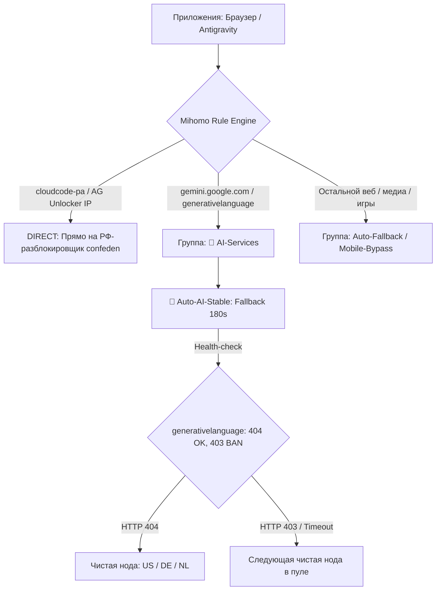

# План внедрения: Стабилизация IP и Health-Check фолбэков для Gemini и Antigravity

## Цели и контекст
Пользователь столкнулся с геоблокировкой веб-версии Gemini (*«Gemini пока не поддерживается в вашей стране»*) и сбоями в Google Antigravity. При этом для Antigravity локально используется утилита [confeden/Antigravity](https://github.com/confeden/Antigravity), подменяющая NRPT и gRPC-маршрутизацию к серверам разблокировки в РФ.

**Задачи:**
1. Настроить выделенный пул **`🤖 Auto-AI-Stable`** для AI-трафика с проверкой реального эндпоинта Google AI (`https://generativelanguage.googleapis.com` с `expected-status: 404`), чтобы ноды, возвращающие 403 Forbidden / Geo-Block, мгновенно выбывали из ротации.
2. Стабилизировать IP: увеличить интервал проверок до **180 секунд** и число попыток `max-failed-times: 3`, предотвращая частую смену IP и стран (IP-jitter / flapping), которая триггерит антифрод Google и сброс сессий.
3. Обеспечить бесконфликтную работу с **AG Unlocker**: добавить домены `cloudcode-pa.googleapis.com`, `daily-cloudcode-pa.googleapis.com` и IP-адреса анлокера в `DIRECT` и `fake-ip-filter`, чтобы Mihomo TUN не перехватывал их.
4. Расширить детектор блокировок `geo_block_detector.py` русскоязычными паттернами Google Gemini.

---

## Архитектура маршрутизации



---

## User Review Required

> [!IMPORTANT]
> Выделенный пул `🤖 Auto-AI-Stable` исключает любые транзитные мосты (`Москва → EU`) и ноды с метками RU. В пул включаются исключительно датацентровые ноды США, Германии, Нидерландов, Великобритании, Швеции и Финляндии.

> [!NOTE]
> Хосты `cloudcode-pa.googleapis.com` и `daily-cloudcode-pa.googleapis.com` выводятся из `fake-ip` в `fake-ip-filter` и направляются в `DIRECT`. Это позволяет службе `ag_dns` и системному NRPT безошибочно резолвить и доставлять трафик к разблокировщику confeden без двойного туннелирования.

---

## Предлагаемые изменения

### 1. `geo_block_detector.py`
#### [MODIFY] geo_block_detector.py
Добавить русскоязычные сигнатуры блокировки Google Gemini:
```python
BLOCK_PATTERNS = [
    "not available in your country",
    "unsupported_country",
    "access denied",
    "error code 1020",
    "blocked by cloudflare",
    "sorry, you have been blocked",
    "location not supported",
    "service unavailable in your region",
    "не поддерживается в вашей стране",
    "пока не поддерживается",
    "gemini пока не поддерживается"
]
```

---

### 2. `sync.py`
#### [MODIFY] sync.py
1. Добавить группу `🤖 Auto-AI-Stable` в `proxy_groups`:
```python
        {
            "name": "🤖 Auto-AI-Stable",
            "type": "fallback",
            "url": "https://generativelanguage.googleapis.com",
            "expected-status": "404",
            "interval": 180,
            "timeout": 3000,
            "lazy": False,
            "max-failed-times": 3,
            "proxies": ai_proxies
        }
```
2. Обновить `DEFAULT_CATEGORIES` для `🤖 AI-Services`:
```python
    {
        "name": "🤖 AI-Services",
        "priority": "ai",
        "default_options": ["🤖 Auto-AI-Stable", "Auto-Fallback", "🛡️ Mobile-Bypass", "DIRECT"],
        "rules": [
            "DOMAIN-SUFFIX,gemini.google.com",
            "DOMAIN-SUFFIX,generativelanguage.googleapis.com",
            "DOMAIN-SUFFIX,aistudio.google.com",
            ...
        ]
    }
```
3. Добавить хосты и IP анлокера в `base_rules` (до общих правил googleapis):
```python
        # Antigravity Unlocker (confeden) direct bypass
        "DOMAIN,cloudcode-pa.googleapis.com,DIRECT",
        "DOMAIN,daily-cloudcode-pa.googleapis.com,DIRECT",
        "IP-CIDR,45.155.204.190/32,DIRECT,no-resolve",
        "IP-CIDR,83.220.169.155/32,DIRECT,no-resolve",
```
4. Добавить хосты анлокера в `fake-ip-filter` секции `dns`:
```python
        "fake-ip-filter": [
            "cloudcode-pa.googleapis.com",
            "daily-cloudcode-pa.googleapis.com",
            "*.lan", "*.local", ...
        ]
```

---

### 3. Тесты `test_telemetry.py`
#### [MODIFY] test_telemetry.py
Добавить тесты:
- Проверка обнаружения русской страницы геоблока Gemini (`"Gemini пока не поддерживается в вашей стране"`).
- Проверка формирования группы `🤖 Auto-AI-Stable` и корректного `expected-status`.

---

## План верификации

### Автоматические тесты
1. Запуск тестового набора:
   ```powershell
   python.exe -m unittest test_telemetry.py
   ```
2. Синтетическая генерация конфига `sync.py` без падений и валидация структуры YAML:
   ```powershell
   python.exe sync.py
   ```

### Ручная проверка
1. Обновление профиля в Clash Verge Rev и проверка появления группы `🤖 Auto-AI-Stable`.
2. Проверка доступности:
   ```powershell
   curl.exe -I -x http://127.0.0.1:7897 https://generativelanguage.googleapis.com
   ```
3. Проверка работы Antigravity IDE (генерация кода без ошибки 400/403).
