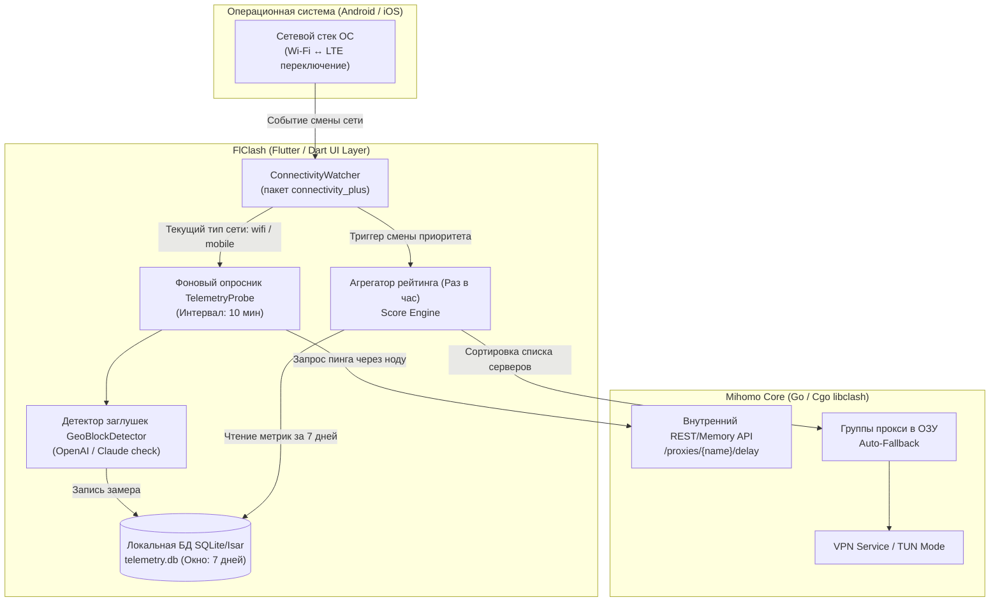

# Техническое задание (RFC): FlClash Adaptive Telemetry Fork
## Умная адаптивная маршрутизация на основе локальной телеметрии (Wi-Fi vs Cellular) и распознавание региональных заглушек

**Версия документа:** 1.0  
**Роль рецензента:** QA Lead & Systems Architect  
**Целевая платформа:** FlClash (Android / iOS / Desktop)  
**Базовый стек:** Flutter (Dart) + Go (`mihomo` / Clash.Meta core via FFI/Cgo)

---

## 1. Введение и бизнес-логика

### 1.1. Проблема текущей архитектуры
Текущие клиенты Mihomo/FlClash используют **статический порядок серверов** в группе `fallback`, задаваемый в конфигурационном YAML-файле. 
- На домашнем **Wi-Fi** провайдер имеет прямые пиринги с Европой (Финляндия / Швеция пингуются за 30–40 мс без потерь).
- На **мобильном интернете (LTE)** сотовые операторы РФ пропускают трафик через жесткие ТСПУ фильтры, блокируют VLESS/Reality по сигнатурам и белым спискам. Финляндия на LTE часто «глохнет» или теряет 30% пакетов, в то время как транзитный мост *Москва ➔ Германия* работает стабильно.
- Текущий `url-test` не решает проблему, так как вызывает постоянный **дребезг (flapping)** и разрыв TCP/WebSocket-сессий при малейших колебаниях пинга.
- Стандартные проверки здоровья (health-check 204) не распознают ситуации, когда прокси отвечает быстро, но сервис (OpenAI, Claude, Gemini) возвращает региональную заглушку: *"Not available in your country"*.

### 1.2. Цель разработки
Создать расширение ядра и интерфейса FlClash, которое:
1. Автоматически и прозрачно для пользователя **логирует реальное качество (пинг, потерю пакетов, аптайм)** каждой ноды в локальную базу данных на устройстве.
2. Ведет **раздельные профили для Wi-Fi и Мобильной сети (Cellular)**.
3. Раз в час пересчитывает взвешенный рейтинг надежности нод за **скользящее окно 7 дней** (с автоматической перезаписью устаревших данных).
4. На лету динамически перестраивает приоритеты нод в группе `Auto-Fallback` в зависимости от того, к какой сети сейчас подключен смартфон.
5. Инспектирует ответы тестовых эндпоинтов и отсекает ноды с региональными заглушками («Access Denied», HTTP 403, 1020).

---

## 2. Архитектура форка



---

## 3. Схема базы данных и управление хранилищем

Для минимизации износа flash-памяти смартфона и экономии ресурсов мы **отказываемся от сохранения каждого сырого пинга** в пользу 10-минутных агрегированных бакетов.

### 3.1. DDL Схема (SQLite / Drift / Isar)

```sql
-- Таблица истории замеров (Бакеты по 10 минут)
CREATE TABLE IF NOT EXISTS node_telemetry (
    id INTEGER PRIMARY KEY AUTOINCREMENT,
    timestamp INTEGER NOT NULL,          -- Unix Epoch (секунды)
    network_type TEXT NOT NULL,          -- 'wifi' ИЛИ 'cellular'
    category TEXT NOT NULL,              -- 'general', 'ai', 'media'
    proxy_name TEXT NOT NULL,            -- Название ноды (напр. '[LockAway] SE')
    latency_ms INTEGER NOT NULL,         -- Средний пинг за интервал (-1 если таймаут)
    packet_loss_rate REAL DEFAULT 0.0,   -- Доля потерянных пакетов (0.0 .. 1.0)
    is_geo_blocked INTEGER DEFAULT 0     -- 1 если обнаружена заглушка 'Not available'
);

CREATE INDEX IF NOT EXISTS idx_telemetry_query 
ON node_telemetry(network_type, category, timestamp);

-- Таблица рассчитанного часового рейтинга (для мгновенного чтения клиентом)
CREATE TABLE IF NOT EXISTS node_scores (
    network_type TEXT NOT NULL,
    category TEXT NOT NULL,
    proxy_name TEXT NOT NULL,
    calculated_score REAL NOT NULL,      -- Чем меньше Score, тем выше приоритет
    uptime_percent REAL NOT NULL,        -- Процент успешных ответов за 7 дней
    avg_latency INTEGER NOT NULL,
    last_updated INTEGER NOT NULL,
    PRIMARY KEY (network_type, category, proxy_name)
);
```

### 3.2. Скользящее окно 7 дней (Круговая перезапись)
Перед каждым ежечасным пересчетом выполняется быстрая операция очистки:
```sql
DELETE FROM node_telemetry 
WHERE timestamp < (strftime('%s', 'now') - 7 * 86400);
```

---

## 4. Алгоритм скоринга и формула приоритета

В отличие от простого среднего арифметического, алгоритм должен жестко штрафовать ноды за нестабильность (packet loss) и блокировки.

### 4.1. Математическая модель рейтинга:
$$\text{Score} = \left( \overline{L} \times \left(1 + 4 \cdot P_{\text{loss}}\right) \right) + \left(B_{\text{geo}} \times 100\,000\right) + \left( (100 - U) \times 50 \right)$$

Где:
- $\overline{L}$ — медианный пинг ноды за последние 7 дней (мс).
- $P_{\text{loss}}$ — коэффициент потери пакетов ($0.0 \dots 1.0$). Если теряется 20% пакетов, штрафной множитель равен $(1 + 4 \times 0.2) = 1.8$.
- $B_{\text{geo}}$ — флаг региональной заглушки ($1$ если сервис выдал блок, иначе $0$). Выбрасывает ноду в конец списка.
- $U$ — аптайм ноды в процентах ($0 \dots 100\%$).

**Результат:** Ноды с наименьшим значением `Score` занимают верхние позиции (Tier 1) в группе `Auto-Fallback` для активного типа сети.

---

## 5. Детектирование заглушек («Недоступно в вашей стране»)

### 5.1. Проблема стандартного 204
Стандартный эндпоинт `https://www.gstatic.com/generate_204` доступен отовсюду и никогда не показывает региональных ограничений сервисов.

### 5.2. Реализация GeoBlockDetector
Для сервисов группы `🤖 AI-Services` модуль телеметрии FlClash отправляет легковесный тестовый HTTP GET запрос через проверяемый прокси к эндпоинту OpenAI:
```text
GET https://android.chat.openai.com/public-api/mobile/server_status/v1
User-Agent: ChatGPT/1.2024.0 (Android; Mobile)
```

**Правила классификации ответа:**
1. **HTTP 200 OK + JSON `{"status": "normal"}`** ➔ Нода пригодна, заглушек нет (`is_geo_blocked = 0`).
2. **HTTP 403 Forbidden** ➔ Гео-блок активен (`is_geo_blocked = 1`, пинг приравнивается к $\infty$).
3. **HTTP 1020 / Cloudflare Challenge (HTML страница)** ➔ Капча / Блок дата-центра (`is_geo_blocked = 1`).
4. **Поиск паттернов в теле ответа (Body Scanner):**
   - `"not available in your country"`
   - `"unsupported_country"`
   - `"access denied"`
   
При совпадении любого паттерна FlClash выставляет `is_geo_blocked = 1`.

---

## 6. QA Lead: Анализ рисков, батареи и памяти

| Риск | Уровень | Последствия без оптимизации | Инженерное решение (Митигация) |
| :--- | :---: | :--- | :--- |
| **Расход батареи (Battery Drain)** | 🔴 Высокий | Если опрашивать 60 нод каждые 20 сек, процессор телефона не уйдет в глубокий сон (Deep Sleep). Батарея сядет на 15–25% быстрее. | 1. Увеличить интервал телеметрии до **10–15 минут**.<br>2. Опрашивать ноды **пакетно (батчами)** за 3 секунды, после чего сразу отпускать WakeLock.<br>3. При заряде батареи < 15% приостанавливать фоновый опрос. |
| **Износ Flash-памяти (Storage Wear)** | 🟠 Средний | Посекундная запись сотен тысяч строк вызовет деградацию eMMC/UFS памяти телефона. | Использование **WAL-режима (Write-Ahead Logging)** в SQLite с отложенным сбросом на диск (`PRAGMA synchronous = NORMAL; PRAGMA journal_mode = WAL;`). Общий размер БД за 7 дней не превысит **4 МБ**. |
| **Дребезг при слабом LTE (Flapping)** | 🟠 Средний | В лифте или метро телефон может переключаться между Wi-Fi и LTE каждые 5 секунд. | **Hysteresis (Задержка переключения):** Переключение профиля телеметрии происходит только если тип сети стабилен более **15 секунд**. |
| **Троттлинг сотовыми операторами** | 🟡 Низкий | Оператор связи видит сотни мелких подключений ко всем IP подряд и временно режет скорость. | Лимитирование конкурентных проверок: не более **3 параллельных замеров** за раз с джиттером (случайная пауза 100–300 мс). |

---

## 7. Этапы разработки форка

1. **Этап 1: Доработка конфигурационного уровня (Zero Code Change):**
   - Внедрение в `sync.py` директивы `expected-status: 200` со спец-эндпоинтами OpenAI для отсева гео-заглушек на текущей версии FlClash.
2. **Этап 2: Dart-модуль телеметрии (`flclash_telemetry`):**
   - Подключение `connectivity_plus`.
   - Создание сервиса `TelemetryDatabaseService` (SQLite WAL, лимит 7 дней).
3. **Этап 3: Движок скоринга и интеграция с ядром Mihomo:**
   - Подписка на события смены сети.
   - Метод `reorderFallbackGroup(networkType)` через FFI вызов к ядрам Mihomo.
4. **Этап 4: CI/CD автоматизация сборки APK:**
   - GitHub Actions workflow для компиляции Flutter + Android NDK (`arm64-v8a`).
